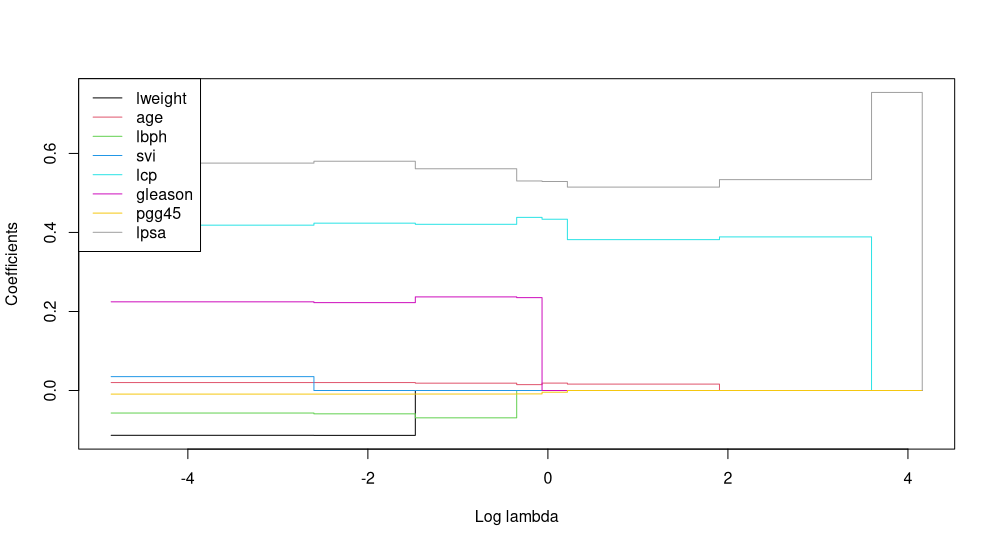
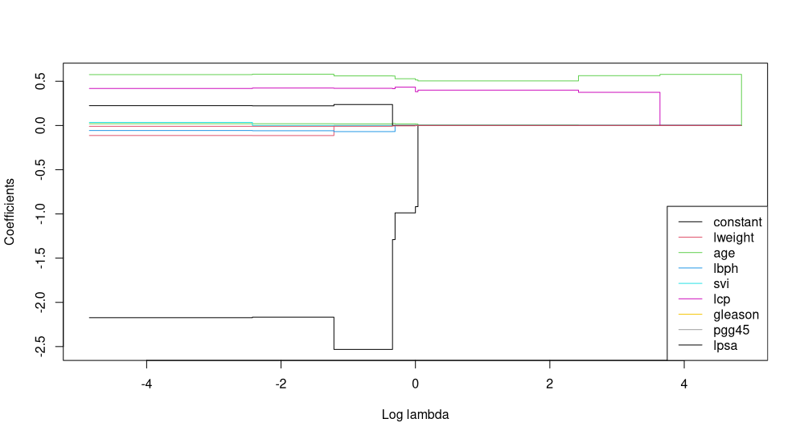

# SparseStep R Package

SparseStep is an R package for sparse regularized regression and provides an 
alternative to methods such as best subset selection, elastic net, lasso, and 
lars. The SparseStep method is introduced in the following paper:

[SparseStep: Approximating the Counting Norm for Sparse 
Regularization](https://arxiv.org/abs/1701.06967) by G.J.J. van den Burg, 
P.J.F. Groenen, and A. Alfons (*Arxiv preprint arXiv:1701.06967 [stat.ME]*, 
2017).

This R package can be easily installed by running 
``install.packages('sparsestep')`` in R. If you use the package in your work, 
please cite the above reference using, for instance, the following BibTeX 
entry:

```bibtex
@article{vandenburg2017sparsestep,
  title = {{SparseStep}: Approximating the Counting Norm for Sparse Regularization},
  author = {{Van den Burg}, G. J. J. and Groenen, P. J. F. and Alfons, A.},
  journal = {arXiv preprint arXiv:1701.06967},
  year = {2017}
}
```

## Introduction

The SparseStep method solves the regression problem regularized with the 
[`l_0` norm](https://en.wikipedia.org/wiki/Lp_space#When_p_=_0). Since the 
`l_0` term is highly non-convex and therefore difficult to optimize, this 
non-convexity is introduced gradually in SparseStep during optimization. As in 
other regularized regression methods such as ridge regression and lasso, a 
regularization parameter ``lambda`` can be specified to control the amount of 
regularization.  The choice of regularization parameter affects how many 
non-zero variables remain in the final model.

We will give a quick guide to SparseStep using the Prostate dataset from the 
book [Elements of Statistical 
Learning](https://web.stanford.edu/~hastie/ElemStatLearn/). 

We will show a few examples of running SparseStep on the Prostate dataset from 
the [lasso2](https://cran.r-project.org/web/packages/lasso2/index.html) 
package. First we load the data and create a data matrix and outcome vector:

```r
> prostate <- read.table("http://statweb.stanford.edu/~tibs/ElemStatLearn/datasets/prostate.data")
> X <- prostate[prostate$train == T, c(-1, -10)]
> X <- as.matrix(X)
> y <- prostate[prostate$train == T, 1]
> y <- as.vector(y)
```

The easiest way to fit a SparseStep model is to use the ``path.sparsestep`` 
function. This estimates the entire path of solutions for the SparseStep model 
for different values of the regularization parameter using a [golden section 
search](https://en.wikipedia.org/wiki/Golden-section_search) algorithm.

```r
> path <- path.sparsestep(X, y)
Found maximum value of lambda: 2^( 7 )
Found minimum value of lambda: 2^( -3 )
Running search in interval [ -3 , 7 ] ...
Running search in interval [ -3 , 2 ] ...
Running search in interval [ -3 , -0.5 ] ...
Running search in interval [ -3 , -1.75 ] ...
Running search in interval [ -0.5 , 2 ] ...
Running search in interval [ -0.5 , 0.75 ] ...
Running search in interval [ 0.125 , 0.75 ] ...
Running search in interval [ 2 , 7 ] ...

> plot(path, col=1:nrow(path$beta))     # col specifies colors to matplot
> legend('topleft', legend=rownames(path$beta), lty=1, col=1:nrow(path$beta))
```

In the resulting plot we can see the coefficients of the features that are 
included in the model at different values of ``lambda``:



The coefficients of the model can be obtained using ``coef(path)``, which 
returns a sparse matrix:

```r
> coef(path)
9 x 9 sparse Matrix of class "dgCMatrix"
                   s0           s1           s2          s3           s4         s5        s6       s7
Intercept  1.31349155  1.313491553  1.313491553  1.31349155  1.313491553 1.31349155 1.3134916 1.313492
lweight   -0.11336968 -0.113485291  .            .           .           .          .         .
age        0.02010188  0.020182049  0.018605327  0.01491472  0.018704172 0.01623212 .         .
lbph      -0.05698125 -0.059026246 -0.069116923  .           .           .          .         .
svi        0.03511645  .            .            .           .           .          .         .
lcp        0.41845469  0.423398063  0.420516410  0.43806447  0.433449263 0.38174743 0.3887863 .
gleason    0.22438690  0.222333394  0.236944796  0.23503609  .           .          .         .
pgg45     -0.00911273 -0.009084031 -0.008949463 -0.00853420 -0.004328518 .          .         .
lpsa       0.57545508  0.580111724  0.561063637  0.53017309  0.528953966 0.51473225 0.5336907 0.754266
                s8
Intercept 1.313492
lweight   .
age       .
lbph      .
svi       .
lcp       .
gleason   .
pgg45     .
lpsa      .
```

Note that the final model included in ``coef(beta)`` is a intercept-only 
model, which is generally not very useful. Predicting out-of-sample data can 
be done easily using the ``predict`` function.

By default SparseStep centers the regressors and outcome variable ``y`` and 
normalizes the regressors ``X`` to ensure that the regularization is applied 
evenly among them and the intercept is not penalized. If you prefer to use a 
constant term in the regression and penalize this as well, you'll have to 
transform the input data and disable the intercept:

```r
> Z <- cbind(constant=1, X)
> path <- path.sparsestep(Z, y, intercept=F)
...
> plot(path, col=1:nrow(path$beta))
> legend('bottomright', legend=rownames(path$beta), lty=1, col=1:nrow(path$beta))
```

Note that since we add the constant through the data matrix it is subject to 
regularization and therefore sparsity:



For more information and examples, please see the documentation included with 
the package. In particular, the following pages are good places to start:

```r
> ?'sparsestep-package'
> ?sparsestep
> ?path.sparsestep
```

## Reference

If you use SparseStep in any of your projects, please cite the paper using the 
information available through the R command:

    citation('sparsestep')

or use the following BibTeX code:

    @article{van2017sparsestep,
      title = {{SparseStep}: Approximating the Counting Norm for Sparse Regularization},
      author = {Gerrit J.J. {van den Burg} and Patrick J.F. Groenen and Andreas Alfons},
      journal = {arXiv preprint arXiv:1701.06967},
      archiveprefix = {arXiv},
      year = {2017},
      eprint = {1701.06967},
      url = {https://arxiv.org/abs/1701.06967},
      primaryclass = {stat.ME},
      keywords = {Statistics - Methodology, 62J05, 62J07},
    }

## Notes

This package is licensed under GPLv3. Please see the LICENSE file for more 
information. If you have any questions or comments about this package, please 
open an issue [on GitHub](https://github.com/GjjvdBurg/sparsestep) (don't 
hesitate, you're helping to make this project better for everyone!). If you 
prefer to use email, please write to ``gertjanvandenburg at gmail dot com``.
